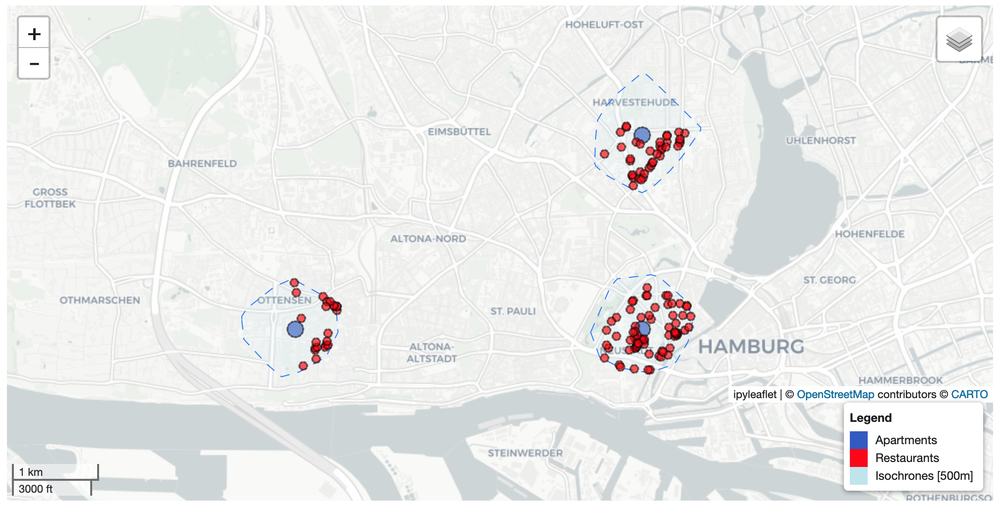

# Geospatial Python Sneak Peek

This repository gives a brief demonstration of how to perform geospatial analysis using Python, openrouteservice and ohsome API. It is a classic site selection analysis to find a suitable apartment.

To get started right away without setting up the Python environment on your computer, you can run the analysis on. Just click the button.

<p align=center>

</p>

If you'd like to install and run it on your own computer, see below.  

## Installation

Create a new python environment and install the required packages.

```
pip install -r requirements.txt
```

## Usage

Start `jupyter notebook` and open the notebook `apartment_search.ipynb`. You can just scroll through the notebook and read the comments or execute each cell one by one to understand what is being done. Play around with the variables in the cells which are marked with **Exercise**.
